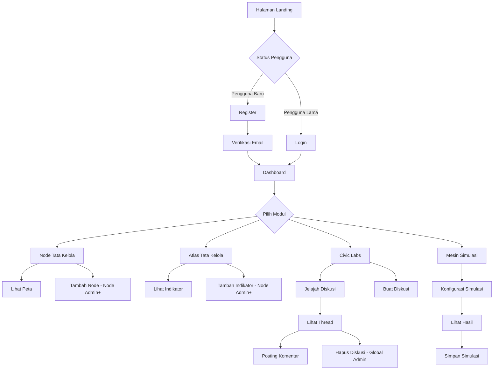

# 🌐 NeuroDemocracy Protocol (NDP)

<div align="center">


**Platform Terdistribusi untuk Riset Tata Kelola Demokratis & Simulasi Kebijakan**

[🇬🇧 English Version](README.md) | **🇮🇩 Versi Indonesia**

[Fitur](#-fitur) • [Instalasi](#-instalasi) • [Peran Pengguna](#-peran-pengguna) • [Alur Aplikasi](#-alur-aplikasi) • [Tech Stack](#-tech-stack)

</div>

---

## 📖 Tentang

**NeuroDemocracy Protocol (NDP)** adalah platform berbasis web inovatif yang dirancang untuk memfasilitasi riset kolaboratif tentang tata kelola demokratis, analisis kebijakan, dan keterlibatan sipil. Platform ini memungkinkan peneliti, institusi, dan warga untuk:

- 🗺️ **Memetakan node tata kelola** di berbagai wilayah dan institusi
- 📊 **Melacak indikator akuntabilitas** menggunakan metrik standar
- 💬 **Terlibat dalam diskusi kebijakan** melalui Civic Labs
- 🧪 **Mensimulasikan dampak kebijakan** dengan model berbasis data
- 📈 **Memvisualisasikan kesehatan demokrasi** melalui dashboard interaktif

Dibangun dengan teknologi web modern, NDP menyediakan lingkungan yang mulus, responsif, dan akademis untuk riset inovasi demokratis.

---

## ✨ Fitur

### 🎯 Modul Utama

#### 1. **Dashboard**
- Ikhtisar real-time metrik platform
- Visualisasi data interaktif dengan Chart.js
- Wawasan cepat tentang node, indikator, dan diskusi
- Pelacakan aktivitas terbaru (simulasi & diskusi)
- Sorotan mingguan dan analitik performa

#### 2. **Node Tata Kelola**
- Visualisasi peta interaktif menggunakan Leaflet.js
- Tambah, lihat, dan kelola node riset secara global
- Detail node: nama, institusi, negara, koordinat
- Kontrol akses berbasis peran untuk manajemen node
- Layout grid kartu responsif

#### 3. **Atlas Tata Kelola**
- Sistem pelacakan indikator komprehensif
- Metrik berbasis skor (skala 0-100)
- Progress bar visual dan badge berkode warna
- Atribusi sumber untuk transparansi data
- Tabel responsif dengan kartu mobile-optimized
- Kemampuan filter dan sort

#### 4. **Civic Labs**
- Forum diskusi untuk topik kebijakan
- Sistem percakapan berbasis thread
- Avatar pengguna dan timestamp
- Buat, lihat, dan hapus diskusi
- Sistem komentar dengan update real-time
- Empty state dengan prompt membantu

#### 5. **Mesin Simulasi**
- Alat simulasi dampak kebijakan
- Interface split-panel (konfigurasi + hasil)
- Chart interaktif menunjukkan skenario sebelum/sesudah
- Kalkulasi persentase perubahan
- Visualisasi dampak dengan indikator tren
- Pelacakan simulasi historis

### 🎨 Fitur UI/UX

- **Desain Modern**: Interface bersih, elegan, bergaya akademis
- **Fully Responsive**: Dioptimalkan untuk mobile, tablet, dan desktop
- **Dark Mode**: Dukungan tema gelap lengkap
- **Bottom Navigation**: Navigation bar ramah mobile
- **Animasi Halus**: Transisi, efek hover, dan micro-interactions
- **Heroicons**: Ikonografi konsisten di seluruh aplikasi
- **Gradient Backgrounds**: Efek blob animasi
- **Glass Morphism**: Efek backdrop blur untuk estetika modern

### 🔐 Autentikasi & Keamanan

- **Laravel Breeze**: Scaffolding autentikasi aman
- **Password Toggle**: Fungsi tampilkan/sembunyikan password
- **Email Verification**: Sistem verifikasi akun
- **Password Reset**: Alur lupa password
- **Session Management**: Fungsi ingat saya
- **CSRF Protection**: Keamanan Laravel bawaan

---

## 👥 Peran Pengguna

Platform mengimplementasikan sistem **Role-Based Access Control (RBAC)** dengan tiga peran berbeda:

### 1. 🎓 **Student (Mahasiswa)**
**Izin:**
- ✅ Lihat dashboard dan analitik
- ✅ Lihat node tata kelola dan atlas
- ✅ Berpartisipasi dalam diskusi Civic Labs
- ✅ Posting komentar pada thread yang ada
- ✅ Jalankan simulasi kebijakan
- ❌ Tidak dapat mengelola node atau indikator
- ❌ Tidak dapat menghapus diskusi

**Use Case:** Peneliti, mahasiswa, dan pengamat yang ingin terlibat dengan platform dan berkontribusi dalam diskusi.

---

### 2. 🏛️ **Node Admin (Admin Node)**
**Izin:**
- ✅ Semua izin Student
- ✅ **Kelola Node**: Buat, update, hapus node tata kelola
- ✅ **Kelola Atlas**: Tambah, update, hapus indikator
- ✅ Lihat analitik spesifik node
- ❌ Tidak dapat menghapus diskusi pengguna lain
- ❌ Terbatas pada node yang ditugaskan

**Use Case:** Perwakilan institusional, peneliti tata kelola lokal, atau koordinator regional yang mengelola node spesifik.

---

### 3. 👑 **Global Admin (Admin Global)**
**Izin:**
- ✅ Semua izin Node Admin
- ✅ **Kelola Labs**: Buat dan hapus diskusi apapun
- ✅ **Akses Platform Penuh**: Operasi CRUD tanpa batasan
- ✅ Kemampuan manajemen pengguna
- ✅ Analitik dan pelaporan sistem-wide
- ✅ Akses audit log

**Use Case:** Administrator platform, koordinator riset, atau pemimpin proyek dengan kontrol penuh atas sistem.

---

## 🔄 Alur Aplikasi

### 📝 Perjalanan Pengguna



### 🎯 Workflow Utama

#### **1. Workflow Manajemen Node**
```
Login → Dashboard → Nodes → Tambah Node (Node Admin+) → 
Isi Form (Nama, Institusi, Negara, Koordinat) → 
Submit → Lihat di Peta → Sukses
```

#### **2. Workflow Pelacakan Indikator**
```
Login → Dashboard → Atlas → Tambah Indikator (Node Admin+) → 
Pilih Node → Masukkan Nama Indikator → Set Skor (0-100) → 
Tambah Sumber → Submit → Lihat di Tabel → Sukses
```

#### **3. Workflow Diskusi**
```
Login → Dashboard → Civic Labs → Buat Diskusi → 
Masukkan Judul & Deskripsi → Submit → Lihat Thread → 
Posting Komentar → Terlibat dengan Komunitas → Sukses
```

#### **4. Workflow Simulasi**
```
Login → Dashboard → Simulasi → Pilih Node → 
Pilih Indikator → Set Perubahan % → Jalankan Simulasi → 
Lihat Hasil Chart → Analisis Dampak → Simpan Hasil → Sukses
```

---

## 🛠️ Tech Stack

### Backend
- **Framework**: Laravel 12.x
- **Autentikasi**: Laravel Breeze
- **Otorisasi**: Spatie Laravel Permission
- **Database**: MySQL
- **API**: Laravel Sanctum

### Frontend
- **Framework**: Vue.js 3.x
- **Routing**: Inertia.js v2
- **Styling**: Tailwind CSS 4.x
- **Icons**: Heroicons
- **Charts**: Chart.js + vue-chartjs
- **Maps**: Leaflet.js
- **Build Tool**: Vite 6.x

### Development Tools
- **Code Quality**: Laravel Pint
- **Testing**: Pest PHP v4
- **Browser Testing**: Pest Browser Testing
- **Package Manager**: npm

---

## 🚀 Instalasi

### Prasyarat
- PHP 8.3+
- Composer
- Node.js 18+ & npm
- MySQL 8.0+

### Langkah-Langkah Setup

1. **Clone repository**
```bash
git clone <repository-url>
cd ndp-app
```

2. **Install dependensi PHP**
```bash
composer install
```

3. **Install dependensi Node**
```bash
npm install
```

4. **Konfigurasi environment**
```bash
cp .env.example .env
php artisan key:generate
```

5. **Konfigurasi database** (`.env`)
```env
DB_CONNECTION=mysql
DB_DATABASE=ndp_app
DB_USERNAME=root
DB_PASSWORD=password_anda
```

6. **Jalankan migrasi & seeder**
```bash
php artisan migrate:fresh --seed
```

7. **Build asset frontend**
```bash
npm run build
# atau untuk development
npm run dev
```

8. **Jalankan server**
```bash
php artisan serve
```

9. **Akses aplikasi**
```
http://localhost:8000
```

### 🔑 Kredensial Default

Setelah seeding, Anda dapat login dengan:

**Global Admin:**
- Email: `admin@ndp.test`
- Password: `password`

**Node Admin:**
- Email: `node@ndp.test`
- Password: `password`

**Student:**
- Email: `student@ndp.test`
- Password: `password`

---

## 📱 Screenshot

### Dashboard
Dashboard analitik modern dengan metrik real-time dan visualisasi.

### Node Tata Kelola
Peta interaktif menampilkan node riset di seluruh dunia.

### Atlas Tata Kelola
Pelacakan indikator komprehensif dengan visualisasi progress.

### Civic Labs
Forum diskusi untuk dialog kebijakan kolaboratif.

### Mesin Simulasi
Simulasi dampak kebijakan dengan analisis sebelum/sesudah.

---

## 🧪 Testing

Jalankan test suite:
```bash
# Semua test
php artisan test

# File test spesifik
php artisan test tests/Feature/NodeTest.php

# Dengan coverage
php artisan test --coverage
```

---

## 📚 Dokumentasi API

Platform menggunakan Inertia.js untuk pengalaman SPA yang mulus. Endpoint utama:

- `GET /dashboard` - Tampilan dashboard
- `GET /nodes` - Index nodes
- `POST /nodes` - Buat node
- `GET /atlas` - Index atlas
- `POST /atlas` - Tambah indikator
- `GET /labs` - Index labs
- `POST /labs` - Buat diskusi
- `POST /simulation` - Jalankan simulasi

---

## 🤝 Kontribusi

Kami menyambut kontribusi! Ikuti langkah berikut:

1. Fork repository
2. Buat branch fitur (`git checkout -b feature/FiturMenakjubkan`)
3. Commit perubahan (`git commit -m 'Tambah FiturMenakjubkan'`)
4. Push ke branch (`git push origin feature/FiturMenakjubkan`)
5. Buka Pull Request

---

## 📄 Lisensi

Proyek ini dilisensikan di bawah MIT License - lihat file LICENSE untuk detail.

---

## 👨‍💻 Tim Pengembang

Dibangun dengan ❤️ oleh NeuroDemocracy Research Initiative

---

## 📞 Dukungan

Untuk pertanyaan atau dukungan:
- 📧 Email: support@neurodemocracy.org
- 🐛 Issues: [GitHub Issues](https://github.com/your-repo/issues)
- 📖 Docs: [Dokumentasi](https://docs.neurodemocracy.org)

---

<div align="center">

**⭐ Beri bintang repository ini jika Anda merasa terbantu!**

Dibuat dengan Laravel, Vue.js, dan semangat untuk inovasi demokratis.

</div>
