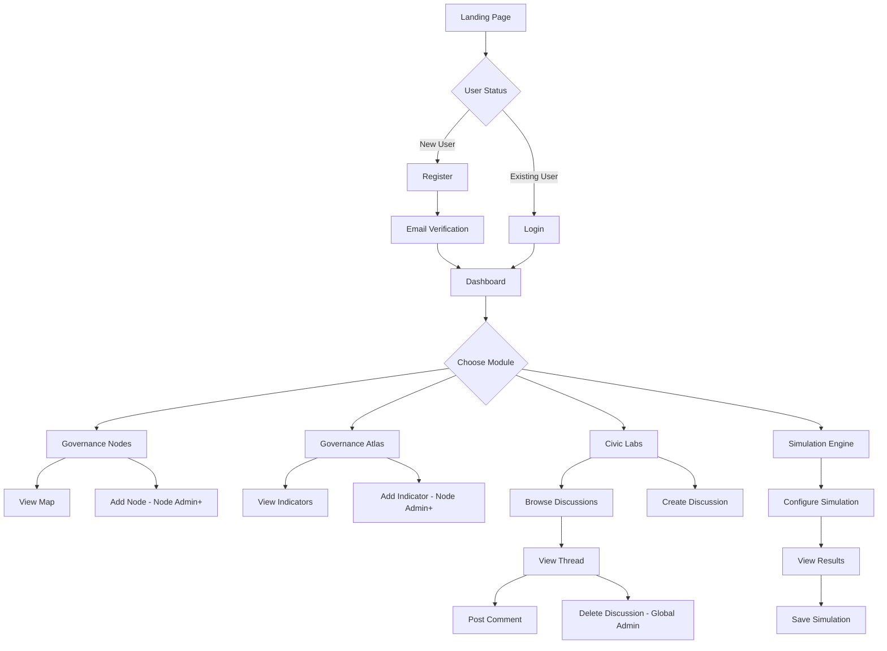

# 🌐 NeuroDemocracy Protocol (NDP)

<div align="center">


**A Distributed Platform for Democratic Governance Research & Policy Simulation**

**🇬🇧 English Version** | [🇮🇩 Versi Indonesia](README.id.md)

[Features](#-features) • [Installation](#-installation) • [User Roles](#-user-roles) • [Application Flow](#-application-flow) • [Tech Stack](#-tech-stack)

</div>

---

## 📖 About

**NeuroDemocracy Protocol (NDP)** is an innovative web-based platform designed to facilitate collaborative research on democratic governance, policy analysis, and civic engagement. The platform enables researchers, institutions, and citizens to:

- 🗺️ **Map governance nodes** across different regions and institutions
- 📊 **Track accountability indicators** using standardized metrics
- 💬 **Engage in policy discussions** through Civic Labs
- 🧪 **Simulate policy impacts** with data-driven models
- 📈 **Visualize democratic health** through interactive dashboards

Built with modern web technologies, NDP provides a seamless, responsive, and academically rigorous environment for democratic innovation research.

---

## ✨ Features

### 🎯 Core Modules

#### 1. **Dashboard**
- Real-time overview of platform metrics
- Interactive data visualizations with Chart.js
- Quick insights on nodes, indicators, and discussions
- Recent activity tracking (simulations & discussions)
- Weekly highlights and performance analytics

#### 2. **Governance Nodes**
- Interactive map visualization using Leaflet.js
- Add, view, and manage research nodes globally
- Node details: name, institution, country, coordinates
- Role-based access control for node management
- Responsive card grid layout

#### 3. **Governance Atlas**
- Comprehensive indicator tracking system
- Score-based metrics (0-100 scale)
- Visual progress bars and color-coded badges
- Source attribution for data transparency
- Responsive table with mobile-optimized cards
- Filter and sort capabilities

#### 4. **Civic Labs**
- Discussion forum for policy topics
- Thread-based conversation system
- User avatars and timestamps
- Create, view, and delete discussions
- Comment system with real-time updates
- Empty states with helpful prompts

#### 5. **Simulation Engine**
- Policy impact simulation tool
- Split-panel interface (configuration + results)
- Interactive charts showing before/after scenarios
- Change percentage calculations
- Impact visualization with trend indicators
- Historical simulation tracking

### 🎨 UI/UX Features

- **Modern Design**: Clean, elegant, academic-style interface
- **Fully Responsive**: Mobile, tablet, and desktop optimized
- **Dark Mode**: Complete dark theme support
- **Bottom Navigation**: Mobile-friendly navigation bar
- **Smooth Animations**: Transitions, hover effects, and micro-interactions
- **Heroicons**: Consistent iconography throughout
- **Gradient Backgrounds**: Animated blob effects
- **Glass Morphism**: Backdrop blur effects for modern aesthetics

### 🔐 Authentication & Security

- **Laravel Breeze**: Secure authentication scaffolding
- **Password Toggle**: Show/hide password functionality
- **Email Verification**: Account verification system
- **Password Reset**: Forgot password flow
- **Session Management**: Remember me functionality
- **CSRF Protection**: Built-in Laravel security

---

## 👥 User Roles

The platform implements a **Role-Based Access Control (RBAC)** system with three distinct roles:

### 1. 🎓 **Student**
**Permissions:**
- ✅ View dashboard and analytics
- ✅ View governance nodes and atlas
- ✅ Participate in Civic Labs discussions
- ✅ Post comments on existing threads
- ✅ Run policy simulations
- ❌ Cannot manage nodes or indicators
- ❌ Cannot delete discussions

**Use Case:** Researchers, students, and observers who want to engage with the platform and contribute to discussions.

---

### 2. 🏛️ **Node Admin**
**Permissions:**
- ✅ All Student permissions
- ✅ **Manage Nodes**: Create, update, delete governance nodes
- ✅ **Manage Atlas**: Add, update, delete indicators
- ✅ View node-specific analytics
- ❌ Cannot delete other users' discussions
- ❌ Limited to their assigned nodes

**Use Case:** Institutional representatives, local governance researchers, or regional coordinators managing specific nodes.

---

### 3. 👑 **Global Admin**
**Permissions:**
- ✅ All Node Admin permissions
- ✅ **Manage Labs**: Create and delete any discussion
- ✅ **Full Platform Access**: Unrestricted CRUD operations
- ✅ User management capabilities
- ✅ System-wide analytics and reporting
- ✅ Audit log access

**Use Case:** Platform administrators, research coordinators, or project leads with full control over the system.

---

## 🔄 Application Flow

### 📝 User Journey



### 🎯 Key Workflows

#### **1. Node Management Workflow**
```
Login → Dashboard → Nodes → Add Node (Node Admin+) → 
Fill Form (Name, Institution, Country, Coordinates) → 
Submit → View on Map → Success
```

#### **2. Indicator Tracking Workflow**
```
Login → Dashboard → Atlas → Add Indicator (Node Admin+) → 
Select Node → Enter Indicator Name → Set Score (0-100) → 
Add Source → Submit → View in Table → Success
```

#### **3. Discussion Workflow**
```
Login → Dashboard → Civic Labs → Create Discussion → 
Enter Title & Description → Submit → View Thread → 
Post Comments → Engage with Community → Success
```

#### **4. Simulation Workflow**
```
Login → Dashboard → Simulation → Select Node → 
Choose Indicator → Set Change % → Run Simulation → 
View Chart Results → Analyze Impact → Save Results → Success
```

---

## 🛠️ Tech Stack

### Backend
- **Framework**: Laravel 12.x
- **Authentication**: Laravel Breeze
- **Authorization**: Spatie Laravel Permission
- **Database**: MySQL
- **API**: Laravel Sanctum

### Frontend
- **Framework**: Vue.js 3.x
- **Routing**: Inertia.js v2
- **Styling**: Tailwind CSS 4.x
- **Icons**: Heroicons
- **Charts**: Chart.js + vue-chartjs
- **Maps**: Leaflet.js
- **Build Tool**: Vite 6.x

### Development Tools
- **Code Quality**: Laravel Pint
- **Testing**: Pest PHP v4
- **Browser Testing**: Pest Browser Testing
- **Package Manager**: npm

---

## 🚀 Installation

### Prerequisites
- PHP 8.3+
- Composer
- Node.js 18+ & npm
- MySQL 8.0+

### Step-by-Step Setup

1. **Clone the repository**
```bash
git clone <repository-url>
cd ndp-app
```

2. **Install PHP dependencies**
```bash
composer install
```

3. **Install Node dependencies**
```bash
npm install
```

4. **Environment configuration**
```bash
cp .env.example .env
php artisan key:generate
```

5. **Configure database** (`.env`)
```env
DB_CONNECTION=mysql
DB_DATABASE=ndp_app
DB_USERNAME=root
DB_PASSWORD=your_password
```

6. **Run migrations & seeders**
```bash
php artisan migrate:fresh --seed
```

7. **Build frontend assets**
```bash
npm run build
# or for development
npm run dev
```

8. **Start the server**
```bash
php artisan serve
```

9. **Access the application**
```
http://localhost:8000
```

### 🔑 Default Credentials

After seeding, you can login with:

**Global Admin:**
- Email: `admin@ndp.test`
- Password: `password`

**Node Admin:**
- Email: `node@ndp.test`
- Password: `password`

**Student:**
- Email: `student@ndp.test`
- Password: `password`

---

## 📱 Screenshots

### Dashboard
Modern analytics dashboard with real-time metrics and visualizations.

### Governance Nodes
Interactive map showing research nodes worldwide.

### Governance Atlas
Comprehensive indicator tracking with progress visualization.

### Civic Labs
Discussion forum for collaborative policy dialogue.

### Simulation Engine
Policy impact simulation with before/after analysis.

---

## 🧪 Testing

Run the test suite:
```bash
# All tests
php artisan test

# Specific test file
php artisan test tests/Feature/NodeTest.php

# With coverage
php artisan test --coverage
```

---

## 📚 API Documentation

The platform uses Inertia.js for seamless SPA experience. Key endpoints:

- `GET /dashboard` - Dashboard view
- `GET /nodes` - Nodes index
- `POST /nodes` - Create node
- `GET /atlas` - Atlas index
- `POST /atlas` - Add indicator
- `GET /labs` - Labs index
- `POST /labs` - Create discussion
- `POST /simulation` - Run simulation

---

## 🤝 Contributing

We welcome contributions! Please follow these steps:

1. Fork the repository
2. Create a feature branch (`git checkout -b feature/AmazingFeature`)
3. Commit your changes (`git commit -m 'Add some AmazingFeature'`)
4. Push to the branch (`git push origin feature/AmazingFeature`)
5. Open a Pull Request

---

## 📄 License

This project is licensed under the MIT License - see the LICENSE file for details.

---

## 👨‍💻 Development Team

Built with ❤️ by the NeuroDemocracy Research Initiative

---

## 📞 Support

For questions or support:
- 📧 Email: support@neurodemocracy.org
- 🐛 Issues: [GitHub Issues](https://github.com/your-repo/issues)
- 📖 Docs: [Documentation](https://docs.neurodemocracy.org)

---

<div align="center">

**⭐ Star this repository if you find it helpful!**

Made with Laravel, Vue.js, and a passion for democratic innovation.

</div>
